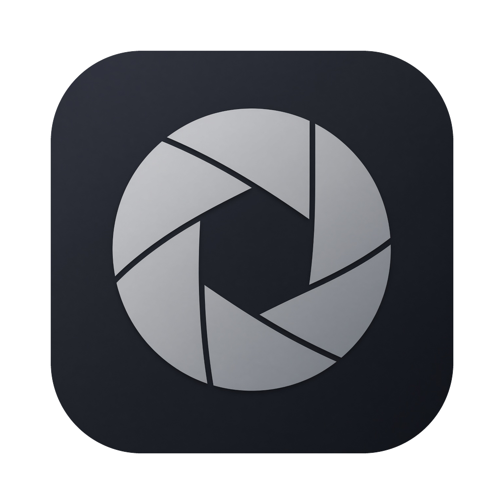
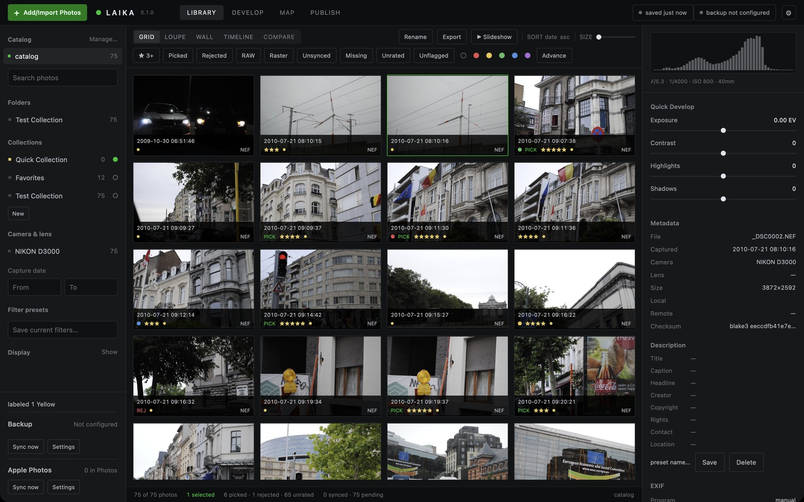
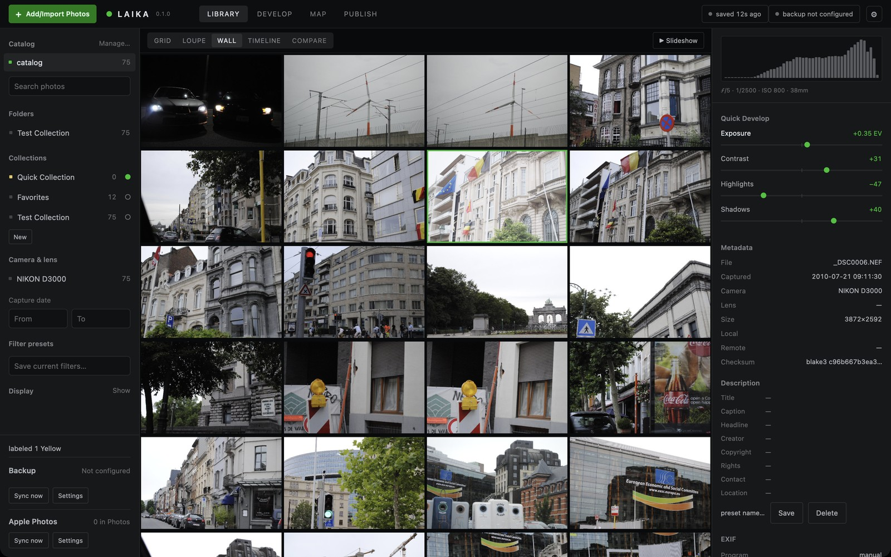
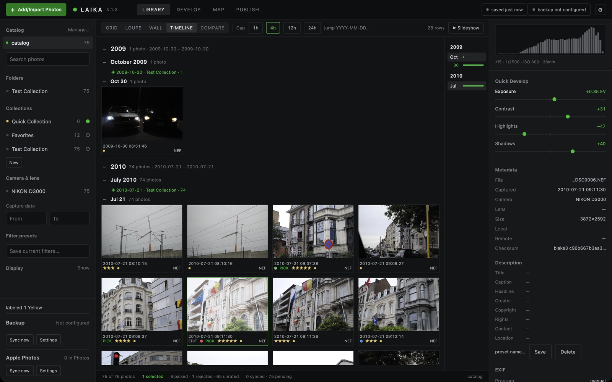
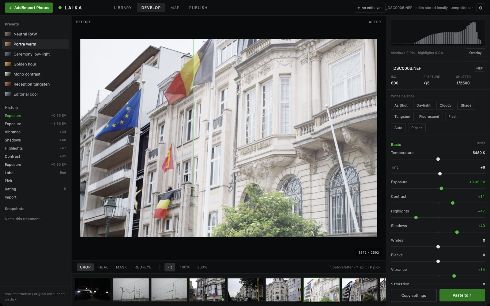
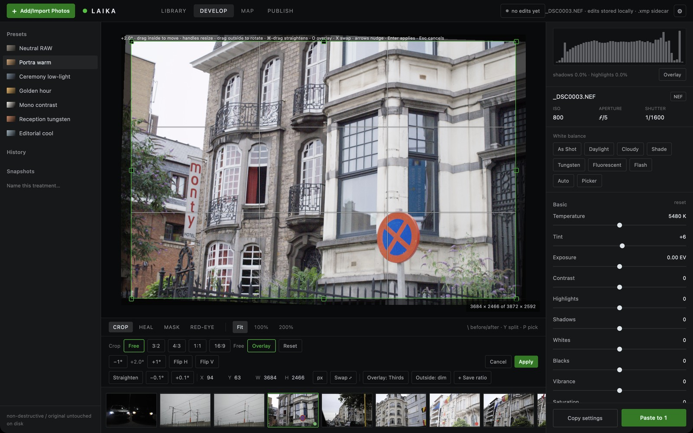
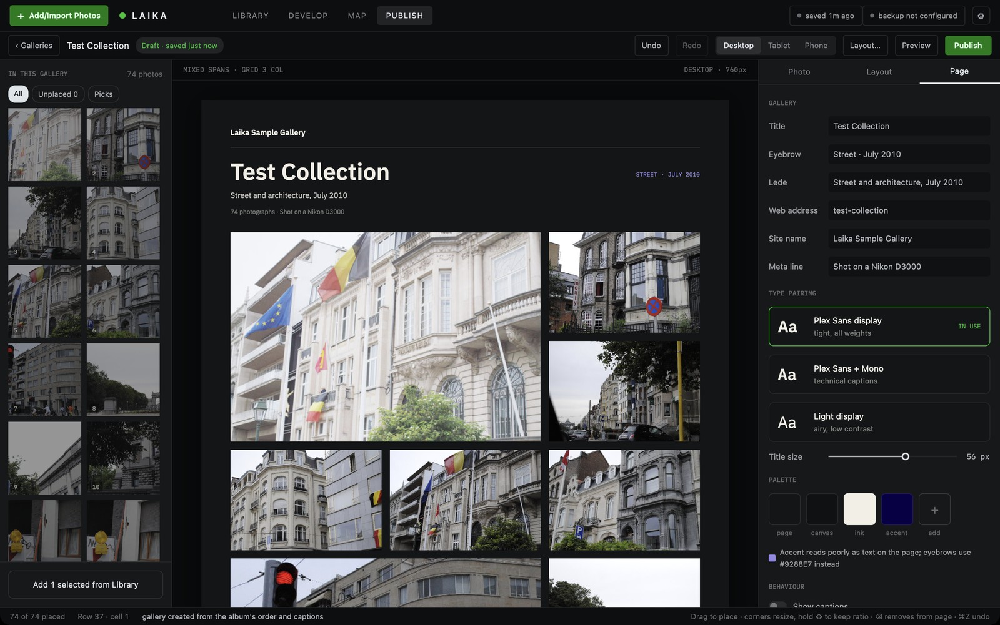
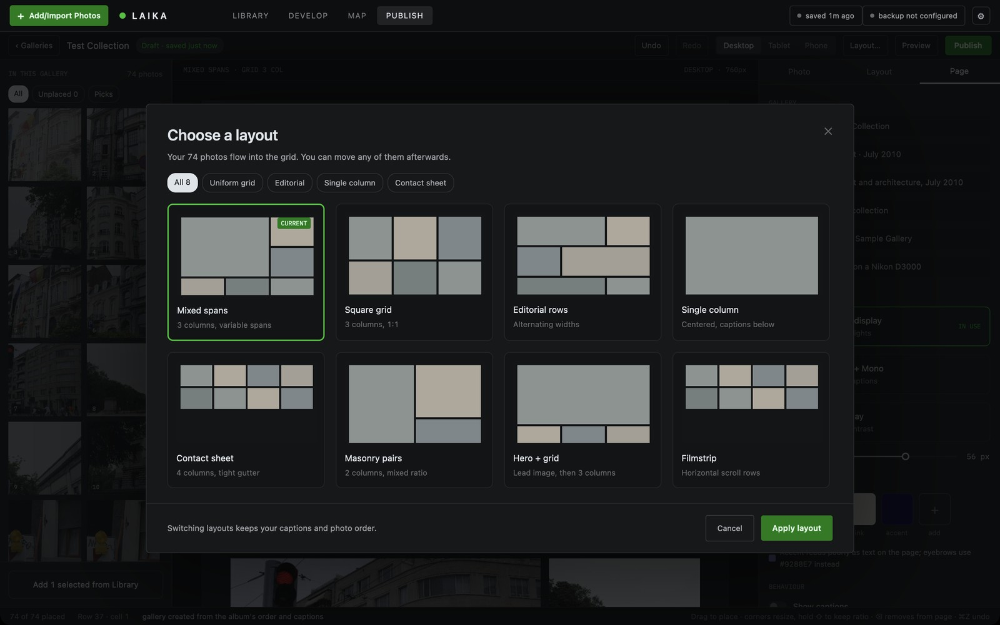
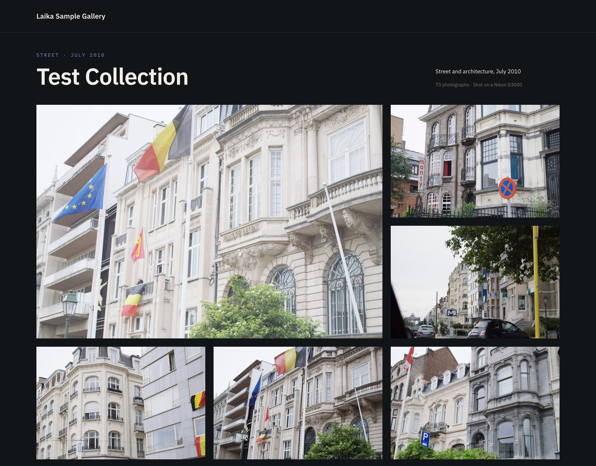
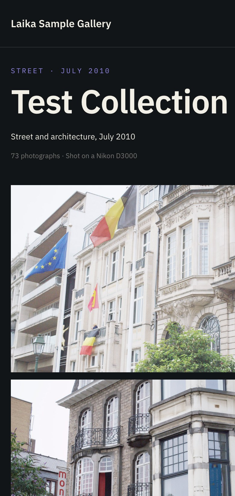

<p align="center">
  
</p>

<h1 align="center">Laika</h1>

<p align="center">
  <b>A local-first photo catalog, RAW developer, and gallery publisher for macOS.</b><br>
  Your originals stay on your disk. Your edits stay non-destructive. Nothing leaves your Mac unless you send it.
</p>

<p align="center">
  <a href="https://github.com/s4njee/laika/releases/latest"></a>
  
  
</p>

<p align="center">
  
</p>

---

Laika brings the Lightroom-style workflow — import, cull, develop, organize, export, publish — into a single fast native app written in Rust. The interface is drawn with [GPUI](https://github.com/zed-industries/zed), RAW files are decoded with [rawler](https://github.com/dnglab/dnglab), and every develop slider runs on the GPU through [wgpu](https://wgpu.rs). The catalog is one SQLite file; every edit is also written to an `.xmp` sidecar beside the original.

## Highlights

- **Fast culling** — ratings, picks, rejects, and color labels from the keyboard, with auto-advance, filters, search, and a live status bar.
- **GPU RAW development** — Basic tone, Tone Curve, HSL, Color Grading wheels, Detail, Optics, Effects, and Transform, with a live before/after split, full history, and snapshots.
- **Crop and geometry** — free and fixed ratios, straighten tool, overlays, numeric entry, and Upright perspective correction (auto or guided).
- **Four ways to browse** — Grid, Loupe, a flush justified Wall, and a capture-ordered Timeline with a year/month scrubber.
- **Collections and albums** — Quick Collection, target collection (`B`), drag photos onto a collection, manual album order, covers, and per-album captions.
- **Gallery builder** — lay photos out on a real page, theme it, preview it in your browser, and publish a static site to a folder or Cloudflare Pages.
- **Verified imports** — from memory cards or folders, with hashed copies, second-copy backup, folder and rename templates, RAW+JPEG pairing, and metadata/develop presets.
- **Exports that respect your edits** — JPEG, PNG, WebP, AVIF, TIFF, or the original file, with presets, watermarks, and post-export actions.
- **Backups your way** — originals and sidecars to S3-compatible storage, SFTP, or a mounted SMB/NFS share, plus Apple Photos import and sync.
- **Honest diagnostics** — rotating logs with credentials scrubbed, an About window with build and GPU details, and opt-in local crash reports.

## Library

Import from a card or a folder and your photos land in a responsive grid with the information you choose: capture time, exposure, file type (`NEF`, `JPG`, …), ratings, pick and reject flags, color labels, and edit/crop/keyword badges. The left rail filters by folder, collection, camera and lens, and capture date; the right rail shows the histogram, Quick Develop, and editable metadata with presets and hierarchical keywords.

<table>
  <tr>
    <td width="50%"><br><sub><b>Wall</b> — a flush, justified thumbnail wall for looking at a shoot as a whole.</sub></td>
    <td width="50%"><br><sub><b>Timeline</b> — capture-ordered sections by year, month, and day with a scrubber.</sub></td>
  </tr>
</table>

Organizing is quick and forgiving:

- Drag photos onto a folder to move them on disk, or onto a collection to add them.
- Right-click any photo to rate, label, export, open in Develop, copy/paste settings, or **Add to Collection** (a ✓ marks collections that already hold it).
- Every action is undoable with `⌘Z`, including metadata and batch changes.
- Offline drives are handled gracefully: missing originals are flagged, can be relinked, and keep working from smart previews.
- Damaged or unsupported RAW files are named with a plain-language reason, and the rest of an import, export, or gallery build carries on.

## Develop

<p align="center">
  
</p>

Every slider renders on the GPU at interactive speed, with the same pipeline used for export so what you see is what you get.

- **Pinned histogram and shot info** — file name, type, ISO, aperture, and shutter stay visible while the panels scroll; the clipping overlay marks pure blacks and whites on the edited side.
- **Panels** — Basic (white balance presets, auto and eyedropper), Tone Curve, HSL, Color Grading, Detail, Optics (chromatic aberration), Effects (texture, clarity, dehaze, vignette, grain), and Transform (Upright and perspective).
- **Before/after** — drag the split or press `\`.
- **History and snapshots** — every step is recorded and survives restarts; name a snapshot to come back to it.
- **Presets** — apply looks at import or in Develop; copy and paste settings across a selection.
- **Crop and geometry** — aspect presets, straighten line, rule-of-thirds and grid overlays, numeric position/size, and Upright auto/guided perspective correction.

<p align="center">
  
  <br><sub><b>Crop and geometry</b> — straighten by degrees or by drawing a line; the crop stays inside the rotated frame, with exact X/Y/W/H entry.</sub>
</p>

## Publish

Turn a collection into a website. The Publish module is a full page editor: drag photos from the tray onto a grid, resize them from the corners, set focal points and captions, pick a layout, and style the page — then build a static site you can host anywhere.

<p align="center">
  
</p>

<table>
  <tr>
    <td width="50%"><br><sub><b>Eight layouts</b> — mixed spans, square grid, editorial rows, single column, contact sheet, masonry pairs, hero + grid, and filmstrip. Switching keeps captions and order.</sub></td>
    <td width="50%"><br><sub><b>The published page</b> — responsive, with a keyboard- and swipe-friendly lightbox and zero external requests.</sub></td>
  </tr>
</table>



- **Canvas that matches the output** — the editor renders your theme, type pairing, title size, palette, captions, and corner radius exactly as the page will.
- **Desktop, tablet, and phone previews** — the grid re-flows for each width without changing your desktop layout.
- **Responsive images** — every photo is rendered with your edits at 640/1280/2048 px (never upscaled), sRGB, with no EXIF or GPS.
- **Incremental, parallel builds** — unchanged photos are reused; a caption edit re-encodes nothing, and new renders run across CPU cores.
- **Preview and publish** — preview opens in your browser; publish builds to a folder or deploys with `wrangler` to Cloudflare Pages, with a diff of what will change.
- **Accessible output** — alt text (falling back to captions), focus-trapped lightbox with `←` `→` `Esc`, and links that work without JavaScript.

<br clear="right">

## Import, export, and backup

| Area | What you get |
|---|---|
| **Import** | Memory cards and cameras with verified (hashed) copies and optional second copy · folder and file-name templates · add in place · RAW+JPEG pairs and video · metadata and develop presets on the way in · skip duplicates |
| **Formats** | RAW via rawler (NEF, CR2/CR3, ARW, RAF, DNG, ORF, RW2, and more) · JPEG, PNG, TIFF, WebP · HEIC via macOS ImageIO · video kept as originals |
| **Export** | JPEG, PNG, WebP, AVIF, TIFF, or Original · size, quality, and file-size limits · naming templates · watermarks (text or graphic) · metadata policy · presets and multi-preset runs · post-export actions |
| **Sidecars** | Every edit, rating, label, and keyword written to `.xmp` beside the original, and read back when another app changes it |
| **Backup** | Originals and sidecars to S3-compatible storage (secrets in the macOS Keychain), SFTP, or a mounted SMB/NFS share · per-photo sync state |
| **Apple Photos** | Import from your Photos library with albums, or add exported photos to an album |
| **Catalogs** | Create, open, switch, and relocate catalogs · automatic backups and migrations · integrity check and optimize · smart previews for offline editing |

## Install

1. Download the latest `Laika-…-macos-arm64.dmg` (or `.zip`) from [Releases](https://github.com/s4njee/laika/releases/latest).
2. Drag **Laika** to Applications.
3. Laika is ad-hoc signed but not notarized, so the first launch needs **right-click → Open** (or run `xattr -cr /Applications/Laika.app`).

On first launch Laika offers to import three sample RAW files so you can try it straight away, or you can import your own photos from a card or folder.

> **Requirements:** macOS 13 or later on Apple silicon.

## Build from source

You need a recent stable Rust toolchain and Xcode command-line tools.

```bash
git clone https://github.com/s4njee/laika.git
cd laika
cargo run --release -p laika-app
```

To produce the same `.app`, `.zip`, and `.dmg` as the releases:

```bash
cargo build --release -p laika-app
scripts/bundle-macos.sh
```

Run the test suite with `cargo test --workspace`. Every push to `main` publishes a [nightly pre-release](https://github.com/s4njee/laika/releases/tag/nightly), and `v*` tags publish versioned releases through [`.github/workflows/release.yml`](.github/workflows/release.yml).

## Keyboard

| Key | Action | Key | Action |
|---|---|---|---|
| `G` `E` `W` `T` | Grid, Loupe, Wall, Timeline | `D` | Develop |
| `1`–`5`, `0` | Rate, clear rating | `P` / `X` / `U` | Pick / reject / unflag |
| `6`–`9` | Red, yellow, green, blue label | `B` | Add to target collection |
| `\` / `Y` | Before/after | `L` / `F` | Lights out, full screen |
| `⌘Z` / `⇧⌘Z` | Undo / redo | `⌘↩` | Slideshow |
| `⌘,` | Preferences | `?` | All shortcuts |

## Project layout

| Crate | What it does |
|---|---|
| [`laika-core`](crates/laika-core) | Catalog (SQLite), import, XMP sidecars, collections and albums, gallery model and layout engine, sync and backup, logging |
| [`laika-raw`](crates/laika-raw) | RAW and raster decoding, previews, EXIF, the linear editing cache |
| [`laika-develop`](crates/laika-develop) | The wgpu render pipeline and WGSL develop shader |
| [`laika-export`](crates/laika-export) | Export encoders, watermarks, and the static gallery site builder |
| [`laika-app`](crates/laika-app) | The GPUI desktop app |

Design notes and the roadmap live in [`plan.md`](plan.md), [`backlog.md`](backlog.md), [`backlogv2.md`](backlogv2.md), and [`photogallery.md`](photogallery.md).

## Status

Laika is an early release. The core workflow — import, cull, develop, organize, export, back up, and publish — works end to end and is covered by tests. Local adjustments (masking, healing), Compare/Survey, DNG conversion, and catalog merge are on the roadmap but not yet available. Bug reports and feedback are very welcome; **Help → About Laika → Copy Diagnostics** gives you everything to include in an issue.

<sub>Screenshots show the Test Collection, shot on a Nikon D3000.</sub>
